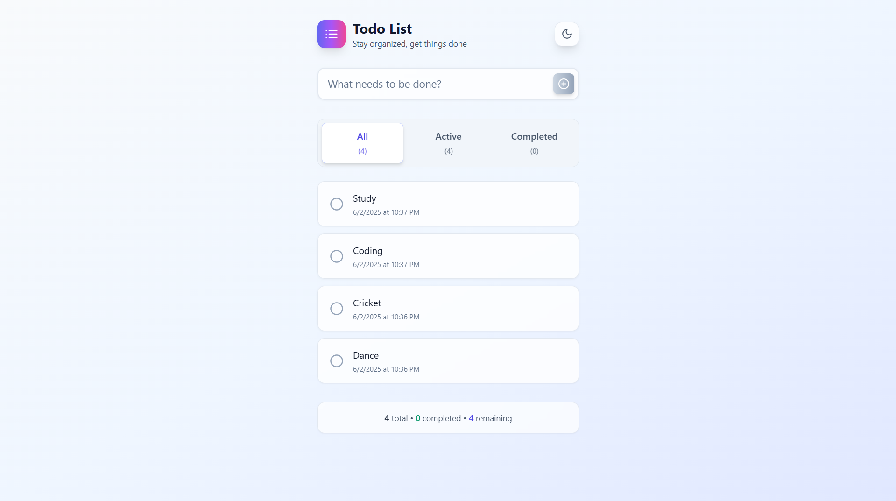
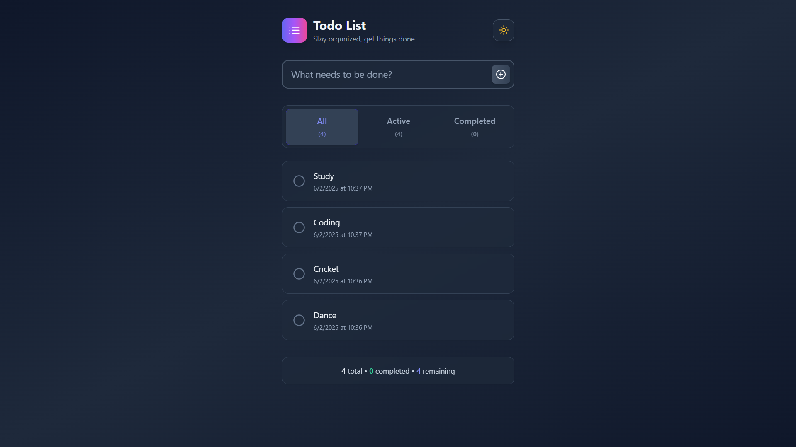
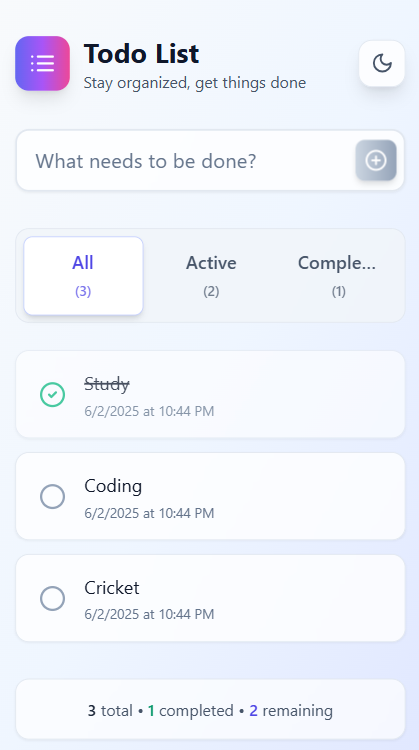
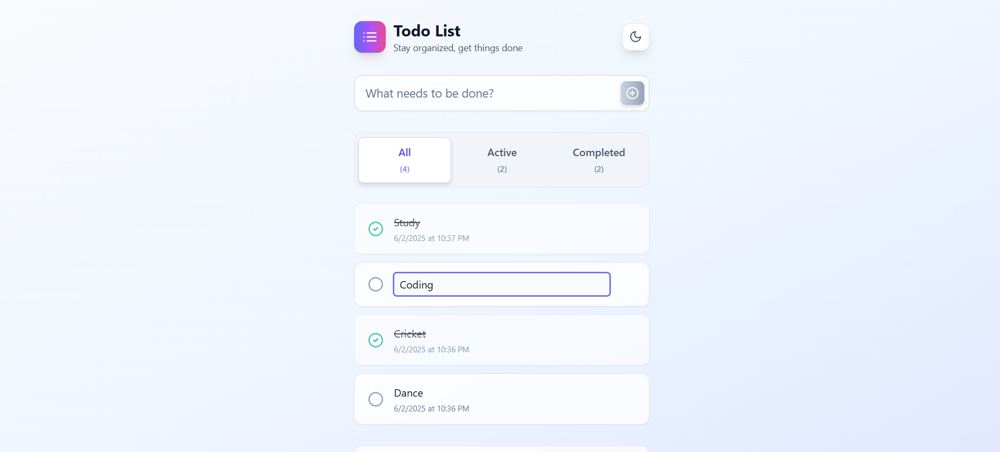
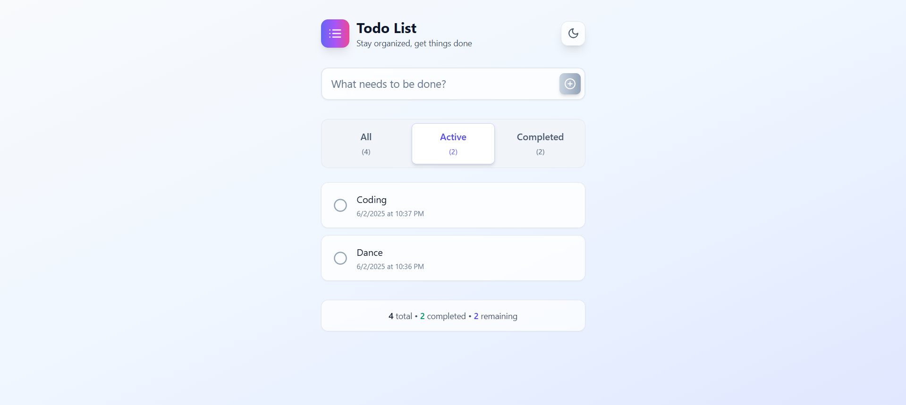
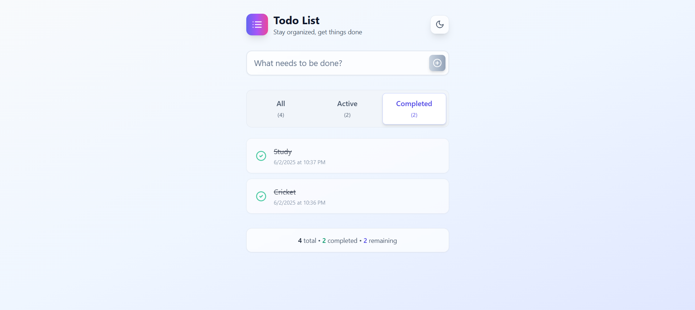

# Todo List Application

A modern, responsive todo list application built with React and TypeScript. Features a clean, intuitive interface with dark/light mode support and persistent local storage.

## ✨ Features

- **Create Todos**: Add new tasks with a simple, elegant form
- **Mark Complete**: Toggle todos between completed and incomplete states
- **Edit Todos**: Double-click or use the edit button to modify existing tasks
- **Delete Todos**: Remove unwanted todos with a single click
- **Smart Filtering**: View all todos, only active ones, or completed ones
- **Dark/Light Mode**: Toggle between themes with a beautiful animated switch
- **Persistent Storage**: Your todos are saved locally and persist between sessions
- **Responsive Design**: Works seamlessly on desktop, tablet, and mobile devices
- **Real-time Stats**: See total, completed, and remaining todo counts at a glance

## 📸 Screenshots

### Light Mode

*Clean, modern interface with light theme*

### Dark Mode

*Elegant dark theme for comfortable nighttime use*

### Mobile Responsive Design


### Feature Showcase




*Built with modern web technologies and best practices*

## 🛠️ Tech Stack

- **React 18** - Modern React with hooks and functional components
- **TypeScript** - Type-safe development for better code quality
- **Vite** - Fast build tool and development server
- **Tailwind CSS** - Utility-first CSS framework for rapid UI development
- **Lucide React** - Beautiful, customizable icons
- **React Router DOM** - Client-side routing
- **Shadcn/UI** - High-quality, accessible UI components

## 🏗️ Architecture

The application follows a clean, modular architecture:

```
src/
├── components/           # Reusable UI components
│   ├── FilterButtons.tsx # Todo filtering interface
│   ├── ThemeToggle.tsx   # Dark/light mode toggle
│   ├── TodoForm.tsx      # New todo creation form
│   ├── TodoItem.tsx      # Individual todo item component
│   └── TodoList.tsx      # Todo list container
├── hooks/                # Custom React hooks
│   ├── useLocalStorage.ts # Local storage persistence
│   └── useTheme.ts       # Theme management
├── types/                # TypeScript type definitions
│   └── todo.ts           # Todo-related types and interfaces
└── pages/                # Page components
    └── Index.tsx         # Main application page
```

### Key Design Patterns

- **Custom Hooks**: Encapsulate reusable logic (localStorage, theme management)
- **Component Composition**: Small, focused components for better maintainability
- **TypeScript Interfaces**: Strict typing for props and data structures
- **Responsive Design**: Mobile-first approach with Tailwind CSS

## 🚀 Getting Started

### Prerequisites

- Node.js (version 16 or higher)
- npm or yarn package manager

### Installation

1. Clone the repository:
```bash
git clone https://github.com/ayush14189/todo-medos.git
cd todo-list-app
```

2. Install dependencies:
```bash
npm install
```

3. Start the development server:
```bash
npm run dev
```

4. Open your browser and navigate to `http://localhost:8080`

### Available Scripts

- `npm run dev` - Start development server with hot reload
- `npm run build` - Build the app for production
- `npm run preview` - Preview the production build locally
- `npm run lint` - Run ESLint for code quality checks

## 📱 Usage

### Creating Todos
1. Type your task in the input field at the top
2. Press Enter or click the plus button to add the todo

### Managing Todos
- **Complete**: Click the circle icon to mark as done
- **Edit**: Click the edit icon or double-click the todo text
- **Delete**: Click the trash icon to remove the todo

### Filtering
Use the filter buttons to view:
- **All**: Show all todos
- **Active**: Show only incomplete todos
- **Completed**: Show only finished todos

### Theme Toggle
Click the sun/moon icon in the top right to switch between light and dark modes.

## 🎨 Design Features

- **Glassmorphism**: Modern glass-like UI elements with backdrop blur
- **Smooth Animations**: Hover effects and transitions for better UX
- **Accessible Colors**: High contrast ratios for better readability
- **Consistent Spacing**: Harmonious layout with Tailwind's spacing scale
- **Icon Integration**: Lucide React icons for intuitive interactions

## 🔧 Customization

### Adding New Features

The modular architecture makes it easy to extend:

1. **New Components**: Add to `src/components/`
2. **Additional Hooks**: Create in `src/hooks/`
3. **Type Extensions**: Update `src/types/todo.ts`

### Styling

The app uses Tailwind CSS classes for styling. Key design tokens:
- **Colors**: Slate grays with indigo/purple accents
- **Shadows**: Layered shadows for depth
- **Borders**: Subtle borders with rounded corners
- **Typography**: Clean, readable font hierarchy
